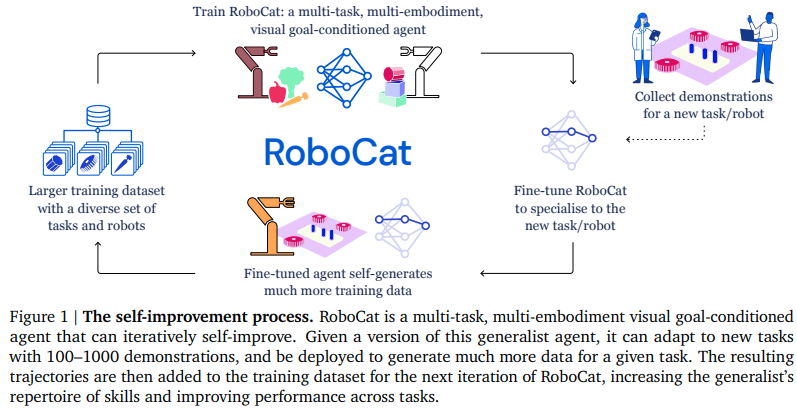

</img>

## RoboCat - Pytorch (wip)

Implementation of Deepmind's <a href="https://storage.googleapis.com/deepmind-media/DeepMind.com/Blog/robocat-a-self-improving-robotic-agent/robocat-a-self-improving-foundation-agent-for-robotic-manipulation.pdf">RoboCat</a>, Self-Improving Foundation Agent for Robotic Manipulation, in Pytorch

## Citations

```bibtex
@article{Bousmalis2023RoboCat,
    title   = {RoboCat: A Self-Improving Foundation Agent for Robotic Manipulation},
    author  = {Konstantinos Bousmalis*, Giulia Vezzani*, Dushyant Rao*, Coline Devin*, Alex X. Lee*, Maria Bauza*, Todor Davchev*, Yuxiang Zhou*, Agrim Gupta*,1, Akhil Raju, Antoine Laurens, Claudio Fantacci, Valentin Dalibard, Martina Zambelli, Murilo Martins, Rugile Pevceviciute, Michiel Blokzijl, Misha Denil, Nathan Batchelor, Thomas Lampe, Emilio Parisotto, Konrad Żołna, Scott Reed, Sergio Gómez Colmenarejo, Jon Scholz, Abbas Abdolmaleki, Oliver Groth, Jean-Baptiste Regli, Oleg Sushkov, Tom Rothörl, José Enrique Chen, Yusuf Aytar, Dave Barker, Joy Ortiz, Martin Riedmiller, Jost Tobias Springenberg, Raia Hadsell†, Francesco Nori† and Nicolas Heess},
    journal = {ArXiv},
    year    = {2023}
}
```
